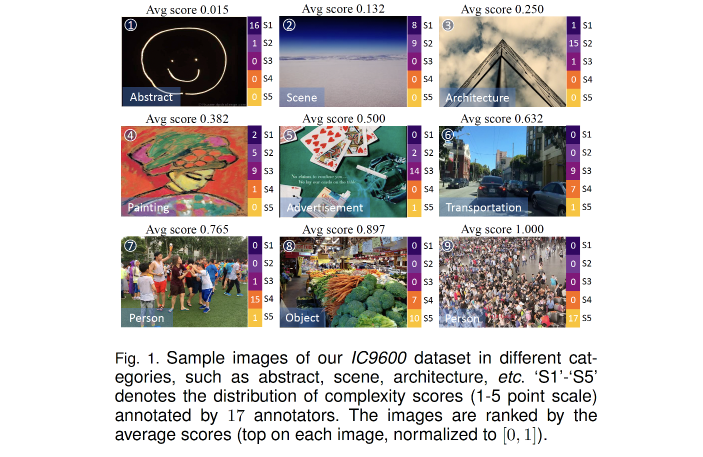

# *IC9600: A Benchmark Dataset for Automatic Image Complexity Assessment*
The official code and dataset of our paper:

*IC9600: A Benchmark Dataset for Automatic Image Complexity Assessment*

 

You can follow the instructions below to run the code.

## 1.Data Preparation
- If you need the IC9600 dataset for academic usage, please send an email explaining your use purpose to `tinglyfeng@163.com`. We will process your application as soon as possible. Please make sure that the email used comes from your educational institution.
-  Uncompress the dataset and put the images and annotations in the working directory.
- Download the pre-trained checkpoint from [Google Drive](https://drive.google.com/drive/folders/1N3FSS91e7FkJWUKqT96y_zcsG9CRuIJw?usp=sharing) and put them in the working directory.
  
The file tree now looks like this:
> checkpoint/\
> └── ck.pth\
> IC9600\
> ├── images\
> ├── test.txt\
> └── train.txt

The above `train.txt` and `test.txt` specify the training and testing images in our experiment, where the first column and second column in each row are image name and ground truth complexity respectively.

## 2.Training and Evaluation
If you want to train ICNet and evaluate the performance on our dataset, just execute the following command:
```
python train.py 
```

Evaluation results will be printed on the terminal.

Note that the key environment used in our experiments are:
```
python==3.9.9
torch==1.8.1+cu111
torchvision==0.9.1+cu111
```


## 3.Generating Image Complexity Scores and Maps
 We provide the off-the-shelf script to generate complexity scores and maps for any given image. To do so, you can simply specify the directory path to your images and the output path saving the results. For instance:
 ```
mkdir out
python gene.py --input example --output out
```

The `example` (the images in which are borrowed from VOC dataset) above is the input directory where your images reside and the `out` is the output path that holds the predictions. 

For each image `img_i.xxx`, a npy file named `img_i_{complexity score}.npy` encoding complexity map is generated, which can be further loaded with `numpy` for any other using purpose.

Besides, to visualize the complexity map, a png file `img_i.png` that blends the original image and complexity map is also produced in the output directory.

Some visualization samples from our paper:
