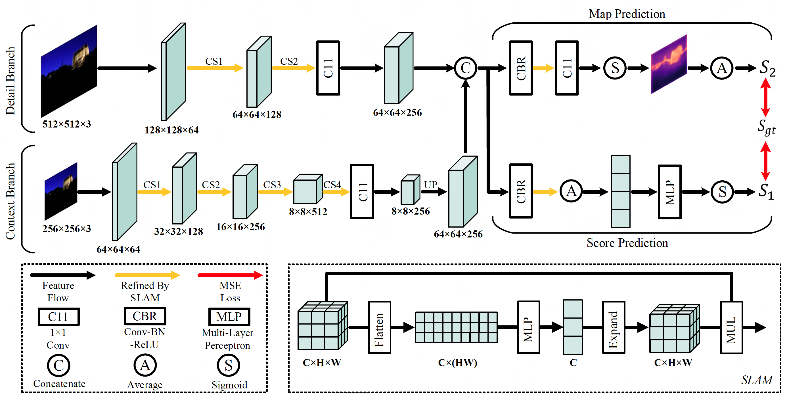

# *IC9600: A Benchmark Dataset for Automatic Image Complexity Assessment*
The official code and dataset of our paper:

*IC9600: A Benchmark Dataset for Automatic Image Complexity Assessment*

<br/>

# Dataset Overview
Sample images of our IC9600 dataset in different categories.'S1-S5' denotes the distribution of complexity scores (1-5 point scale) annotated by 17 annotators. The images are ranked by the average scores (top on each image, normalized to [0, 1]).
<p align="center">
  
</p>

<br/>


# ICNet Pipeline
Pipeline of our proposed ICNet. The model consists of a shallow and a deep extractor modified from a ResNet18. 
The ”CS(N)” on the arrow stands for $N_{th}$ convolutional stage of ResNet18. 
The detail branch captures spatial and low-level features from high-resolution image, while the context branch fed a smaller image extracts context and high-level representations. 
The two kinds of features are then concatenated and sent to the following two heads for map prediction and score prediction. 
Besides, the feature maps with an orange arrow behind them are refined by our proposed spatial layout attention module (SLAM), which can help to scale features according to their spatial layout and produce more effective representations for IC assessment.
<p align="center">
  
</p>
 <br/>

# IC9600 Dataset
If you need the IC9600 dataset for academic usage, please send an email explaining your use purpose to `tinglyfeng@163.com`. We will process your application as soon as possible. Please make sure that the email comes from your educational institution.

<br/>

# Training and Evaluation
Uncompress the dataset and put it in the working directory:

> IC9600\
> ├── images\
> ├── test.txt\
> └── train.txt

The above `train.txt` and `test.txt` specify the training and testing images in our experiment, where the first column and second column in each row are image name and ground truth complexity respectively.

If you want to train ICNet and evaluate the performance on our dataset, just execute the following command:
```
python train.py 
```

Evaluation results will be printed on the terminal.

Note that the key environment used in our experiments are:
```
python==3.9.9
torch==1.8.1+cu111
torchvision==0.9.1+cu111
```
<br/>

# Generating Image Complexity Scores and Maps
We provide the off-the-shelf script to generate complexity scores and maps for any given image. To do so, you should first download the trained model weights from [Google Drive](https://drive.google.com/drive/folders/1N3FSS91e7FkJWUKqT96y_zcsG9CRuIJw?usp=sharing) and put it into the `checkpoint` folder under the working directory:
> checkpoint\
> └── ck.pth

 
Now you can simply specify the directory path to your images and the output path saving the results. For instance:
 ```
mkdir out
python gene.py --input example --output out
```

The `example` (the images in which are borrowed from VOC dataset) above is the input directory where your images reside and the `out` is the output path that holds the predictions. 

For each image `img_i.xxx`, a npy file named `img_i_{complexity score}.npy` encoding complexity map is generated, which can be further loaded with `numpy` for any other using purpose.

Besides, to visualize the complexity map, a png file `img_i.png` that blends the original image and complexity map is also produced in the output directory.

<br/>

# Complexity Map Visualizations

Visualization results of some images from our test set. The left (right) image of each pair is the input image (predicted complexity map). 
The number in the bracket represents the predicted complexity score from our model while the number outside the bracket is its ground truth score (normalized to 0 − 1) labeled by the annotators. 

<p align="center">
  
</p>
<br/>

# Resource
- The Chinese version of our paper can be downloaded from [here](https://drive.google.com/file/d/1ZIicvVpP7ObVyT7xCi6FAO6z3pZ4UOTR/view?usp=sharing).
- More resources can be found on our [main page](http://120.77.240.72/).
<br/>


# Citation
If you find this repo useful, please cite the following publication:
```
@article{feng2023ic9600,
  title={IC9600: A Benchmark Dataset for Automatic Image Complexity Assessment},
  author={Feng, Tinglei and Zhai, Yingjie and Yang, Jufeng and Liang, Jie and Fan, Deng-Ping and Zhang, Jing and Shao, Ling and Tao, Dacheng},
  journal={IEEE Transactions on Pattern Analysis and Machine Intelligence},
  number={01},
  pages={1--17},
  year={2023},
  publisher={IEEE Computer Society},
  doi={10.1109/TPAMI.2022.3232328},
}
```